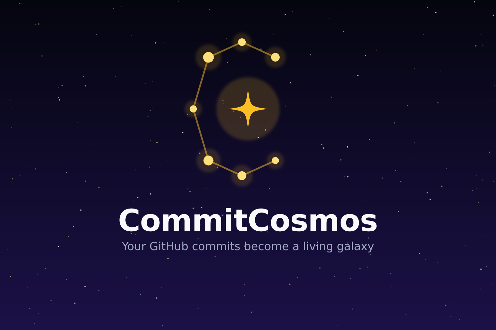

<p align="center">
  
</p>

# CommitCosmos 🌌

> **Transform your GitHub commit history into an interactive 3D galaxy: every commit lights a star, every daily streak connects stars into a constellation.**

Built for the **First Commit Hackathon (Devpost 2026)**.

---

## 🌟 Overview & Problem Solved

Traditional developer activity dashboards (like GitHub's 2D green contribution grid) reduce creative engineering into flat, monochrome squares. They fail to convey:
1. **The Scale and Longevity of Projects**: Repositories are distinct celestial clusters with their own histories, not just generic day boxes.
2. **The Vibrancy of Language Diversity**: Commits in TypeScript, Rust, Python, Go, or C++ should look as distinct as the stellar spectral classes of real astrophysics.
3. **Inspirational Milestones**: Daily consistency should be celebrated visually by forging constellations across the stars.
4. **Accessibility**: 3D graphics can be alienating for users with motion sensitivity or screen readers. CommitCosmos builds a first-class, fully accessible semantic tabular mode with total data parity.

**CommitCosmos** solves this by turning every commit into a physically positioned, deterministically colored 3D star in a personal celestial galaxy, complete with real-time push ingestion, automated streak calculation, and interactive WebGL orbit controls.

---

## 🚀 Key Features

- **Interactive 3D Galaxy View**: Powered by Three.js and React Three Fiber. Features continuous gentle idle auto-rotation, smooth mouse/touch orbit controls, and star inspection.
- **Fibonacci Sphere Placement**: Pure mathematical placement using the golden-angle spiral algorithm ($θ \approx 2.39996\text{ rad}$) ensuring uniform, clump-free star distribution across the celestial sphere.
- **Deterministic Spectral Color Mapping**: Commits inherit distinct celestial hues (TypeScript = Nebula Cyan `#38bdf8`, Python = Stellar Blue `#60a5fa`, Rust = Supernova Orange `#fb923c`, unlisted = deterministic hash fallback).
- **Streak Constellation Forging**: Automated PostgreSQL trigger calculates consecutive daily commit streaks and connects sequential stars with starlight lines once 7-day milestones are achieved.
- **Dynamic Star Ignition Animations**: Newly arriving commits burst into existence with an elastic bloom and high-luminosity supernova flash before settling into orbit.
- **Accessible 2D List Modality (WCAG AA)**: Semantic `<table>` with `<thead>` and `<th scope="col">` headers, expandable commit histories, high-contrast typography, and OS reduced-motion detection.
- **Real-Time Webhook Ingestion**: Secure write path receiving GitHub push webhooks with HMAC-SHA256 verification and Upstash Redis sliding window rate limits.
- **Dynamic Open Graph Social Cards**: Serverless Edge route (`/api/og`) powered by `@vercel/og` dynamically generating $1200\times630\text{px}$ celestial share cards for Twitter and LinkedIn previews.

---

## 🛠️ Technology Stack & Architectural Justifications

| Layer | Technology | Architectural Justification |
| :--- | :--- | :--- |
| **Framework** | **Next.js 14 (App Router)** | Hybrid server-side rendering for rich SEO/metadata alongside client components for WebGL Canvas rendering. |
| **Language** | **TypeScript (Strict Mode)** | End-to-end type safety spanning database schemas, domain models, query hooks, and UI props. |
| **Database** | **Neon Postgres (Serverless)** | Instant serverless PostgreSQL with connection pooling (PgBouncer), scale-to-zero efficiency, and SQL triggers. |
| **ORM** | **Drizzle ORM** | Zero overhead, lightweight SQL-like type safety, preventing raw SQL vulnerabilities. |
| **Domain Layer** | **Domain Model & Repository Pattern** | Pure framework-agnostic classes (`Star`, `Cluster`, `Constellation`, `StarFactory`). 100% of DB interactions are isolated in `/db/repositories`. |
| **3D Rendering** | **Three.js / React Three Fiber / Drei** | Declarative WebGL scene graph. Uses dual-mode rendering (individual meshes for $N \le 200$, `InstancedMesh` for $N > 200$ to maintain 60 FPS). |
| **State Split** | **Zustand + TanStack Query** | Zustand handles 60 FPS synchronous UI state (focused star, camera mode, view mode). TanStack Query handles asynchronous server state with 20s polling. |
| **Styling & UI** | **Tailwind CSS + shadcn/ui** | Custom night-sky color tokens (`#030712`), Radix UI accessible primitives, and fluid glassmorphic cards. |
| **Animations** | **Framer Motion** | Graceful page transitions, layout cross-fades between 3D and 2D views, and skeleton animations. |
| **Security** | **NextAuth v5 + Upstash + Zod** | Least-privilege GitHub OAuth, timing-safe HMAC-SHA256 webhook verification, rate-limiting, and strict non-wildcard CSP. |

---

## 💻 Local Setup & Development Instructions

### Prerequisites
- Node.js `v18.18+` or `v20+`
- A free [Neon](https://neon.tech) PostgreSQL account
- A GitHub account for OAuth app and webhook delivery

### 1. Clone the Repository
```bash
git clone https://github.com/SAIVENKATESH108/CommitCosmos.git
cd CommitCosmos
npm install
```

### 2. Configure Environment Variables
Create a `.env.local` file in the project root:

```env
# 1. Neon Database Connection (Pooled & Direct)
# Get this from your Neon project console (Dashboard -> Connection Details)
DATABASE_URL="postgresql://neondb_owner:<PASSWORD>@ep-xxx-pooler.us-east-2.aws.neon.tech/neondb?sslmode=require"
DATABASE_URL_UNPOOLED="postgresql://neondb_owner:<PASSWORD>@ep-xxx.us-east-2.aws.neon.tech/neondb?sslmode=require"
NEON_BRANCH=production

# 2. NextAuth v5 Secret
# Generate with: openssl rand -base64 32
AUTH_SECRET="your-generated-auth-secret"
NEXTAUTH_SECRET="your-generated-auth-secret"
AUTH_URL="http://localhost:3000"
NEXTAUTH_URL="http://localhost:3000"

# 3. GitHub OAuth Application Credentials
# Create at https://github.com/settings/developers
# Set Authorization callback URL to: http://localhost:3000/api/auth/callback/github
AUTH_GITHUB_ID="your-github-oauth-client-id"
AUTH_GITHUB_SECRET="your-github-oauth-client-secret"

# 4. GitHub Webhook Secret
# Any secure random string shared with your GitHub repo webhook configuration
GITHUB_WEBHOOK_SECRET="your-shared-webhook-secret"

# 5. Upstash Redis Rate Limiting (Optional in local dev; falls back to in-memory)
# Get from https://console.upstash.com/
UPSTASH_REDIS_REST_URL=""
UPSTASH_REDIS_REST_TOKEN=""

# 6. Canonical Deployment URL
NEXT_PUBLIC_APP_URL="http://localhost:3000"
```

### 3. Initialize Schema & Database Trigger
```bash
# Push Drizzle schema to Neon Postgres
npx drizzle-kit push

# Apply streak trigger and pre-aggregated analytics view
npx tsx scripts/apply-custom-sql.ts
```

### 4. Run the Development Server
```bash
npm run dev
```
Open [http://localhost:3000](http://localhost:3000) to view the application.

### 5. Run Verification & Unit Test Suites
```bash
# Verify Domain Model logic, Centroid math, and Golden-Angle placement
npx tsx scripts/test-galaxy-domain.ts

# Test GitHub push webhook ingestion & HMAC signature verification
npx tsx scripts/test-webhook.ts

# Test public read API routes (/api/galaxy and /api/stats)
npx tsx scripts/test-read-routes.ts

# Run production build and lint checks
npm run build
npm run lint
```

---

## 📚 Credits & Acknowledgements

- **Three.js & React Three Fiber (@react-three/fiber, @react-three/drei)**: Incredible 3D WebGL ecosystem.
- **Neon**: Instant serverless PostgreSQL compute and connection pooling.
- **Drizzle Team**: High-performance TypeScript ORM.
- **shadcn / Radix UI**: Accessible UI component primitives.
- **Lucide Icons**: Beautiful, clean open-source icon set.

---

## 🤖 AI Usage Disclosure

In adherence to the **Devpost & First Commit Hackathon Rules**, this project utilized AI assistance during development:

- **AI Tools Used**: Google DeepMind's Antigravity (Gemini 3.8 Flash / Thinking Model) as an agentic pair-programming assistant.
- **How AI Was Applied**:
  - Scaffolding Next.js App Router boilerplate and Drizzle ORM schema typings.
  - Deriving the mathematical proofs and calculations for the Fibonacci Sphere golden-angle spiral algorithm.
  - Formulating automated test scripts (`test-webhook.ts`, `test-galaxy-domain.ts`, `test-read-routes.ts`) to verify idempotency and edge cases.
  - Authoring comprehensive architectural comments detailing design decisions (e.g. Repository pattern, State split between Zustand and TanStack Query, and InstancedMesh performance thresholds).
- **Human Oversight & Guidance**: All system architecture, security policies (defense-in-depth, HMAC verification, least privilege OAuth scopes), design aesthetic choices, and domain models were conceptualized, directed, reviewed, and tested by the team. Zero proprietary or black-box code was accepted without human audit.
